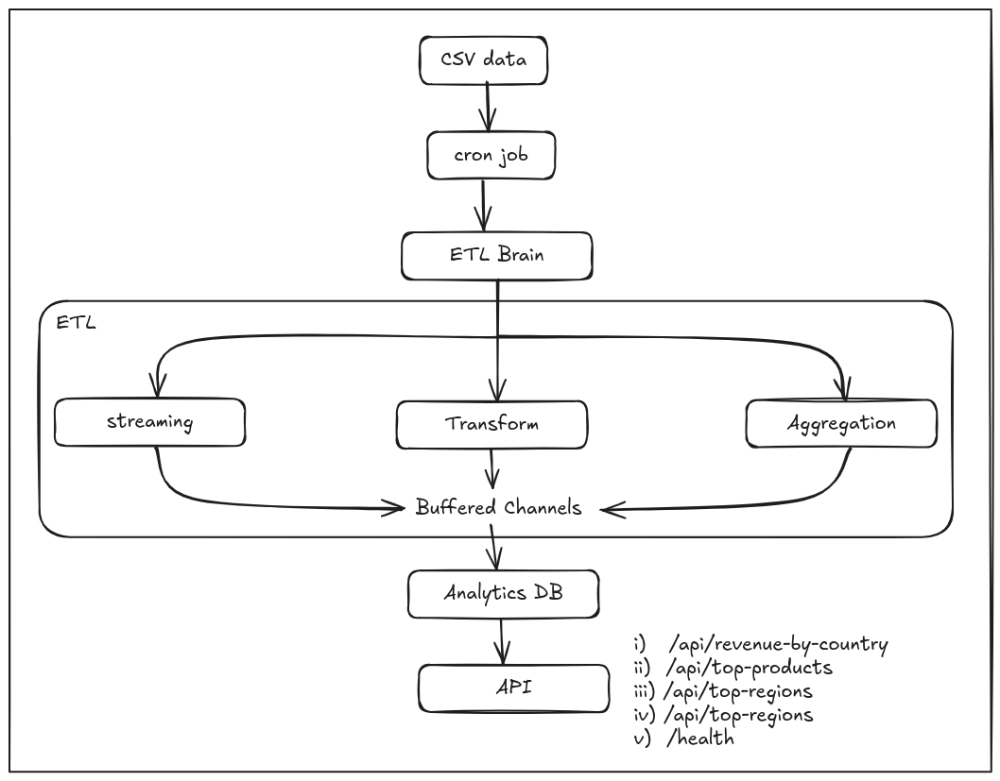

# 📊 Transaction Analytics Platform

## Architecture




## Getting Started

### Prerequisites

- **Go** 1.25+ 
- **Node.js** 22+
- **npm** or **yarn**

### Dataset Setup

**Important**: The dataset is not included in the repository.

1. Download the transaction dataset (`GO_test_5m.csv`)
2. Place it in the `data/` folder

**Expected CSV columns:**
```
transaction_id, transaction_date, user_id, country, region, product_id, 
product_name, category, price, quantity, total_price, stock_quantity, added_date
```

### Backend Setup

```bash
# From project root
go mod download
go run cmd/server/main.go
```

The server will:
1. Start the ETL pipeline immediately
2. Schedule ETL to run every 12 hours
3. Expose API at `http://localhost:8080`

### Frontend Setup

```bash
cd web
npm install
npm run dev
```

The frontend will be available at `http://localhost:5173`

---

## 📡 API Endpoints

| Method | Endpoint | Description |
|--------|----------|-------------|
| `GET` | `/api/revenue-by-country` | Country-level revenue with product breakdown |
| `GET` | `/api/top-products` | Top 20 frequently purchased products |
| `GET` | `/api/monthly-sales` | Monthly sales volume data |
| `GET` | `/api/top-regions` | Top 30 regions by revenue |
| `GET` | `/health` | API health check |

---

## 🔧 ETL Pipeline

### Configuration

```go
ETLConfig{
    Workers:   runtime.NumCPU(),  // Concurrent workers
    BatchSize: 1000,              // Records per batch
    DataPath:  "data/GO_test_5m.csv",
}
```

### Pipeline Stages

1. **Extract** - Reads CSV in batches for memory efficiency
2. **Transform** - Parallel workers normalize and clean data
3. **Aggregate** - Stores aggregated metrics in memory

---


## 🛠️ Tech Stack

### Backend
- **[Go](https://golang.org/)** - Programming language
- **[Echo](https://echo.labstack.com/)** - Web framework


### Frontend
- **[React 19](https://react.dev/)** - UI library
- **[TypeScript](https://www.typescriptlang.org/)** - Type safety
- **[Vite](https://vite.dev/)** - Build tool
- **[Chakra UI v3](https://chakra-ui.com/)** - Component library
- **[ECharts](https://echarts.apache.org/)** - Charting library
- **[AG Grid](https://www.ag-grid.com/)** - Data grid

---

## 📊 Analytics Metrics

### Country Revenue
- Total revenue per country
- Transaction count per country  
- Product-level breakdown with individual revenue

### Product Analytics
- Purchase frequency (quantity sold)
- Current stock levels
- Top 20 most purchased products

### Sales Volume
- Monthly aggregated sales
- Sorted by highest volume

### Regional Performance
- Revenue by region
- Items sold per region
- Top 30 regions

---


## 📚 References

- https://github.com/air-verse/air
- https://echo.labstack.com/guide/
- https://github.com/golang-standards/project-layout
- https://medium.com/@ravishankarsr.rav/building-a-high-performance-buffered-etl-pipeline-in-go-c516ca8e2772
- 


